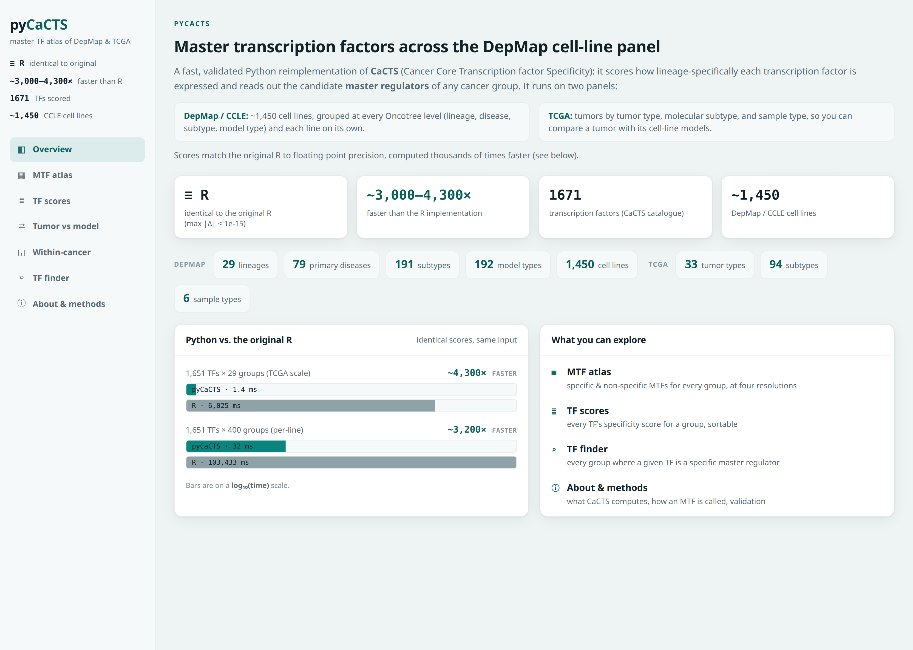
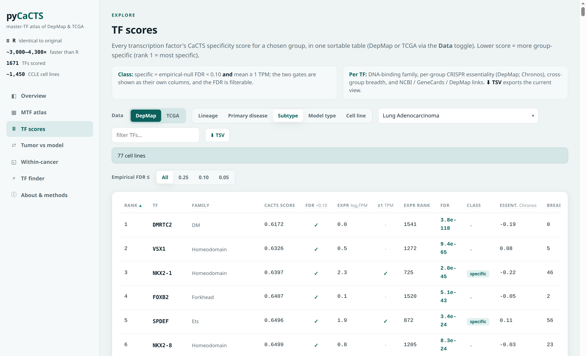

# pyCaCTS

A fast, dependency-light **Python reimplementation of CaCTS** (Cancer Core Transcription factor
Specificity), applied to the **DepMap/CCLE** cell-line panel to nominate master transcription factors
(MTFs) at every level of the disease hierarchy, lineage, primary disease, subtype, model type, and each
individual cell line.

### ▶ Explore the live dashboard: **<https://thirtysix.github.io/pyCaCTS/>**
&nbsp;&nbsp;(browsable MTF atlas, per-group TF scores, and a TF finder &middot; or run it locally, see [Explore the results](#explore-the-results))

[](https://thirtysix.github.io/pyCaCTS/)

> **Credit / original method.** CaCTS is the work of the Lawrenson lab,
> **Reddy J, Fonseca MAS, Corona RI, *et al.*, "Predicting master transcription factors from pan-cancer
> expression data," *Sci. Adv.* 2021;7(48):eabf6123** (PMID 34818047; DOI 10.1126/sciadv.abf6123),
> code at <https://github.com/lawrenson-lab/CaCTS>. This repository is an **independent Python port** of
> their Jensen-Shannon-divergence specificity score, validated numerically against the original R, and
> extended to cell-line panels. All credit for the method is theirs; any errors in this port are mine.
> Their original R is GPL and is **not** redistributed here.

## Why
CaCTS identifies MTFs from **expression alone**: how *specifically* a transcription factor is expressed in
one group relative to the diversity of all groups (a Jensen-Shannon-divergence measure), combined with an
absolute-expression filter. It needs **no ChIP-seq / epigenomic data**. The original was run on TCGA
tumor types; pyCaCTS runs the same method on the DepMap/CCLE cell-line panel (~1,450 lines with
expression), so you can read out the candidate master regulators of any cancer group, down to a single
cell line.

## What it does
- Computes the CaCTS specificity score for every TF × group.
- Groupings supported (one engine): **OncotreeLineage**, **OncotreePrimaryDisease**, **OncotreeSubtype**,
  **DepmapModelType**, and **individual cell line**.
- Calls a **specific MTF** by an **empirical-null FDR &lt; 0.10** (a data-driven specificity gate, replacing
  CaCTS's fixed top-5%-by-score cutoff) **and** a light **&ge; 1 TPM** abundance floor, and keeps CaCTS's
  high-expression / low-specificity **non-specific** (candidate ubiquitous) category.
- The FDR floor recovers genuinely expressed lineage TFs the aggressive top-5%-expression gate dropped
  (e.g. ovarian SOX17 / WT1 / MECOM) while excluding near-silent JSD artifacts.

## What's scored
pyCaCTS scores **1,651 transcription factors** (of the CaCTS 1,671-TF catalogue) across the **1,450
DepMap/CCLE cell lines**, grouped at five nested resolutions of the Oncotree disease hierarchy (coarse and
robust at the top, single-cell-line at the bottom):

| Level | Oncotree field | Groups | Median lines/group | Examples (group size) |
| :-- | :-- | --: | --: | :-- |
| Lineage | `OncotreeLineage` | 29 | 40 | Lung (191), Lymphoid (157), Skin (89), Myeloid (62) |
| Primary disease | `OncotreePrimaryDisease` | 79 | 5 | Non-Small Cell Lung Cancer (137), Melanoma (81), Colorectal Adenocarcinoma (75) |
| Subtype | `OncotreeSubtype` | 191 | 3 | Lung Adenocarcinoma (77), Colon Adenocarcinoma (60), High-Grade Serous Ovarian Cancer (21) |
| Model type | `DepmapModelType` | 192 | 3 | `GB` → Glioblastoma (52), `LUAD` → Lung Adenocarcinoma (77), `HGSOC` → High-Grade Serous Ovarian Cancer (21) |
| Cell line | each line on its own | 1,450 | 1 | A549, MCF7, HELA, NIHOVCAR3, HL60, U2OS |

That is 29 + 79 + 191 + 192 + 1,450 = **1,941 groups** scored, each against the same 1,651-TF universe. The
`Model type` codes are the finest Oncotree labels (the dashboard shows them expanded, e.g. `GB → Glioblastoma`).

## Usage
pyCaCTS is a small importable package (numpy + pandas). Point it at a DepMap release (or any group-mean
expression matrix) and score every TF × group in one call. DepMap inputs
(`OmicsExpressionProteinCodingGenesTPMLogp1.csv`, `Model.csv`, and `CRISPRGeneEffect.csv` for essentiality)
download from the [DepMap data portal](https://depmap.org/portal/data_page/); see `data/README.md`.

```python
from pycacts import io, grouping, score, filter as cfilter

# load a DepMap release + the CaCTS TF universe
expr  = io.load_expression("depmap/OmicsExpressionProteinCodingGenesTPMLogp1.csv")  # genes x lines
model = io.load_model("depmap/Model.csv")                                           # indexed by ModelID
tfs   = io.load_tf_universe("data/CaCTS_merged_1671_TFs.txt")                       # 1,671 TFs

# per-group mean expression at the lineage level, then the CaCTS specificity score
rep, sizes = grouping.build_rep_matrix(expr, model, "lineage", tf_universe=tfs)     # TFs x lineages
scores = score.cacts_score_matrix(rep)          # TFs x lineages, lower = more specific (a few ms)

# master TFs of the Skin lineage: specific = empirical-null FDR < 0.10 AND mean >= 1 TPM
mtfs = cfilter.mtf_categories_fdr(scores, rep, "Skin")
print(mtfs["specific"][:6])                      # ['SOX10', 'RXRG', 'SCML4', 'PAX3', 'OLIG2', 'IRF4']
print(score.rank_specific(scores, "Skin").head())
```

Any column in `Model.csv` is a valid grouping, `"OncotreeSubtype"`, `"DepmapModelType"`, or `"line"` (each
cell line its own group, ~1,450 groups scored in ~0.2 s):

```python
rep, _ = grouping.build_rep_matrix(expr, model, "line", tf_universe=tfs)
S = score.cacts_score_matrix(rep)
```

It is not tied to DepMap, score any **TFs × groups** mean-expression matrix (TCGA tumor types, GTEx
tissues, single-cell pseudobulk, …):

```python
import pandas as pd
from pycacts import score
rep = pd.read_csv("my_group_means.tsv", sep="\t", index_col=0)   # rows = TFs/genes, cols = groups
S = score.cacts_score_matrix(rep)                                # CaCTS JSD; lower = more group-specific
```

Runnable end-to-end example: `python examples/quickstart.py [LINEAGE]` (set `PYCACTS_DEPMAP`; see
`data/README.md`).

### Worked example: master TFs of the TCGA tumor types
CaCTS was originally built on TCGA tumors; here is that analysis with pyCaCTS, from raw download to
master-TF list. (A runnable version is `examples/tcga.py`.)

**1. Download the expression matrix:** TCGA RSEM gene-**TPM** (log2(TPM+0.001), Ensembl-keyed) from the
**UCSC Xena Toil** hub (uniformly re-quantified TCGA, ~740 MB gzipped), plus the gencode.v23 gene probemap
(Ensembl → symbol). TPM is used (not the batch-corrected `EB++` matrix) so a literal 1 TPM abundance floor
applies, in the same units as DepMap:
```bash
curl -L -o tcga_RSEM_gene_tpm.gz \
  "https://toil-xena-hub.s3.us-east-1.amazonaws.com/download/tcga_RSEM_gene_tpm.gz"
curl -L -o gencode.v23.gene.probemap \
  "https://toil-xena-hub.s3.us-east-1.amazonaws.com/download/probeMap/gencode.v23.annotation.gene.probemap"
```

**2. Download the sample → tumor-type map:** the tumor-type mapping CaCTS used (9,691 samples, 33 TCGA
type codes), from the original authors' repo:
```bash
curl -L -o TCGA_sample_types.txt \
  "https://raw.githubusercontent.com/lawrenson-lab/CaCTS/master/files/SuppTable1-34-TCGAID.txt"
```

**3. Score, and read out the master TFs:**
```python
import numpy as np, pandas as pd
from pycacts import io, score, filter as cfilter

tfs = set(io.load_tf_universe("data/CaCTS_merged_1671_TFs.txt"))
ens2sym = dict(pd.read_csv("gencode.v23.gene.probemap", sep="\t", usecols=["id", "gene"]).itertuples(index=False))
keep = {e for e, s in ens2sym.items() if str(s).upper() in tfs}

# load only the TF rows; re-encode log2(TPM+0.001) -> log2(TPM+1), the same units as DepMap
chunks = [c[c.index.isin(keep)] for c in pd.read_csv("tcga_RSEM_gene_tpm.gz", sep="\t", index_col=0, chunksize=4000)]
m = pd.concat(chunks); tpm = np.clip(2.0 ** m.to_numpy(float) - 0.001, 0, None)
expr = pd.DataFrame(np.log2(tpm + 1), index=[str(ens2sym[e]).upper() for e in m.index],
                    columns=m.columns).groupby(level=0).mean()

# map each sample to its tumor type; match on the 15-char sample barcode (TCGA-XX-XXXX-01)
smap = pd.read_csv("TCGA_sample_types.txt", sep="\t")            # columns: Cancer, Category, SampleId
sample2type = dict(zip(smap["SampleId"].str[:15], smap["Cancer"]))
cols = [c for c in expr.columns if c[:15] in sample2type]
types = pd.Series({c: sample2type[c[:15]] for c in cols})
rep = expr[cols].T.groupby(types).mean().T                      # TFs x 33 types (mean log2(TPM+1))

scores = score.cacts_score_matrix(rep)                          # TFs x tumor types, in ~ms
print(score.rank_specific(scores, "SKCM").head())               # cutaneous melanoma
# specific = empirical-null FDR < 0.10 AND mean >= 1 TPM
print("specific MTFs:", cfilter.mtf_categories_fdr(scores, rep, "SKCM")["specific"][:8])
# -> PAX3, SOX10, ALX1, FOXD3, EN2, ZNF280A, RXRG, IRF4  (melanocyte / neural-crest masters; MITF, TFAP2A also in the set)
```
Swap `"SKCM"` for any of the 33 codes (`BRCA`, `LUAD`, `OV`, `GBM`, `LAML`, …). Verified end-to-end on the
files above (`examples/tcga.py`), with the FDR + 1 TPM master-TF call the dashboard uses.

## Validation & performance
pyCaCTS's specificity score is **numerically identical to the original CaCTS R** and dramatically faster.
Scoring the same representative matrices with both `pycacts` (vectorized) and the original `run_CaCTS_score`
(looped), across the **whole DepMap/CCLE panel at all five hierarchy levels**:

| input (TFs × groups) | pyCaCTS | original R | speed-up | max &#124;pyCaCTS − R&#124; |
| :-- | --: | --: | --: | --: |
| 1,651 × 29 (lineage) | **1.3 ms** | 5.5 s | **~4,180×** | 8e-16 |
| 1,651 × 79 (primary disease) | **4.7 ms** | 15.1 s | **~3,240×** | 9e-16 |
| 1,651 × 191 (subtype) | **12.1 ms** | 40.2 s | **~3,320×** | 1e-15 |
| 1,651 × 192 (model type) | **11.9 ms** | 40.3 s | **~3,390×** | 1e-15 |
| 1,651 × 1,450 (per cell line) | **161 ms** | 10.8 min | **~4,020×** | 3e-15 |
| **full panel (all 5 levels)** | **0.19 s** | **12.5 min** | **~3,900×** | identical |

All scores match to floating-point precision (max |Δ| ≤ 3e-15). Reproduce: `python scripts/benchmark_vs_r.py`
(needs R on PATH and the original `reference_R/JSD.R`, kept locally and **not** redistributed).

### Where the speed-up comes from
`scripts/profile_speedup.py` times three Python implementations of the *identical* score on the same input,
isolating each source of the gain (measured at the lineage level, 1,651 TFs × 29 groups):

| step | time | gain | what it removes |
| :-- | --: | --: | :-- |
| original R (`run_CaCTS_score`) | 5,506 ms | 1× | baseline: O(T·G²), + a scores file written per query + `rbind`-in-loop |
| ↳ literal Python transcription | 462 ms | **~12×** | R's per-query file I/O and O(T²) `rbind` growth |
| ↳ vectorized over TFs (numpy) | 9.6 ms | **~48×** | the interpreted per-TF / per-query loops |
| ↳ closed-form (pyCaCTS) | 1.3 ms | **~7.5×** | re-summing over all groups per query |

The three gains are independent and multiply (≈ 12 × 48 × 7.5 ≈ 4,300×, matching the observed ~4,180×). The
first two are ~constant factors; the **closed-form** gain grows with the number of groups (~7× at 29 groups,
~38× at 191, **~286× at 1,450**), because CaCTS's JSD to a one-hot ideal has a closed form in a single value,
so the whole TF × group matrix is one O(T·G) elementwise pass instead of an O(T·G²) per-query loop. That is
what makes per-cell-line scoring tractable (44 s → 0.15 s).

## Explore the results
A static, no-backend **dashboard** lives in `dashboard/`, a browsable MTF atlas across the disease
hierarchy, a sortable per-group **TF-scores** table with empirical-null FDR, a TF finder, and a **TCGA**
side (a Data toggle on the atlas / scores tabs, a tumor-vs-cell-line-model comparison, and a within-cancer
view that re-scores each tumor type across its own molecular subtypes or tumor/normal samples). Run locally
with `cd dashboard && python3 -m http.server 8000`. Regenerate its data with `scripts/stage_dashboard_data.py`
and `scripts/stage_line_data.py`. (Forking to host your own copy? See `dashboard/README.md` for the one-click
GitHub Pages deploy.)



## Layout
```
pycacts/        the package (score / grouping / io / filter / stats [empirical-null FDR])
scripts/        runners: run_divisions, stage_dashboard_data, stage_line_data, build_gene_info,
                stage_essentiality, convert_toil_tcga_tpm, stage_tcga, build_tcga_stage, stage_tcga_within,
                build_crosswalk, benchmark_vs_r, profile_speedup, cacts_reference.R
examples/       quickstart.py (DepMap) + tcga.py (TCGA) runnable examples
dashboard/      static results explorer (index.html + css/ + js/ + data/); GitHub-Pages-ready
data/           bundled TF list + data pointers (large inputs are NOT committed, see data/README.md)
results/        outputs (score matrices, MTF lists, benchmark / profile CSVs): not committed
```

## Data (not committed)
Point pyCaCTS at a downloaded DepMap release via the `PYCACTS_DEPMAP` environment variable (default
`data/depmap/`). See `data/README.md` for the exact files and where to get them. The CaCTS 1,671-TF
catalogue is bundled at `data/CaCTS_merged_1671_TFs.txt`.

## Data sources & citations
pyCaCTS reimplements a published method and its dashboard ships aggregate statistics derived from public
resources. If you use it, please cite:

- **CaCTS (the method reimplemented here):** Reddy J, Fonseca MAS, Corona RI, *et al.* "Predicting master
  transcription factors from pan-cancer expression data." *Science Advances* 2021;7(48):eabf6123.
  DOI [10.1126/sciadv.abf6123](https://doi.org/10.1126/sciadv.abf6123) · code:
  <https://github.com/lawrenson-lab/CaCTS>.
- **DepMap / CCLE** (expression, CRISPR gene-effect, cell-line annotation): Broad Institute DepMap Public
  release, <https://depmap.org>. DepMap data are released under **CC BY 4.0**; the dashboard redistributes
  only per-group aggregates (means, ranks) derived from them; please cite the DepMap release and the
  CCLE/Achilles papers listed at depmap.org. Raw DepMap inputs are not committed (see `data/README.md`).
- **TCGA / UCSC Xena** (the dashboard's TCGA panel and the TCGA worked example): TCGA expression from the
  **UCSC Xena Toil** RSEM-TPM recompute (`tcga_RSEM_gene_tpm`), and molecular-subtype calls from the Xena
  PanCanAtlas hub, <https://xenabrowser.net>; please cite the TCGA Research Network, the Xena resource
  (Goldman *et al.*, *Nat. Biotechnol.* 2020), and the Toil recompute (Vivian *et al.*, *Nat. Biotechnol.*
  2017). The dashboard ships only per-group aggregates.
- **TF universe & families:** Lambert SA, *et al.* "The Human Transcription Factors." *Cell*
  2018;172(4):650–665. DOI 10.1016/j.cell.2018.01.029 (humantfs.ccbr.utoronto.ca); the CaCTS 1,671-TF list
  also draws on Saint-André V, *et al.*, *Genome Research* 2016.

A machine-readable `CITATION.cff` is included, so GitHub shows a "Cite this repository" button.

## License
pyCaCTS is released under the **GNU General Public License v3.0-or-later** (`LICENSE`),
© 2026 Harlan Barker. It is an independent reimplementation written from the published CaCTS method, the
original CaCTS R (also GPL) is credited above and is **not** redistributed here. GPL is a deliberate choice
to keep pyCaCTS, and anything built from it, open, mirroring how the original was released.
